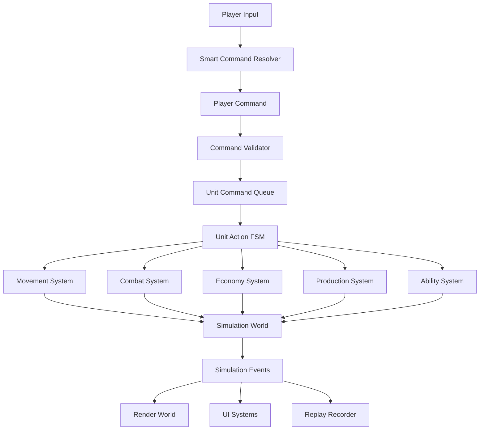
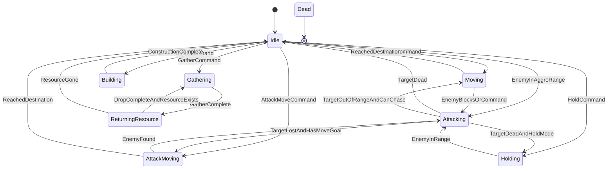

# RTS 게임 아키텍처 및 상세 로직 설계도 v2

> 본 문서는 실시간 전략 시뮬레이션(RTS) 게임을 실제 개발 가능한 수준으로 설계하기 위한 마스터 아키텍처 문서입니다.  
> 단순 기능 나열이 아니라, **결정론적 시뮬레이션**, **데이터 주도 설계**, **EntityId 기반 월드 관리**, **명령 처리 구조**, **저장/리플레이/디버깅 가능성**까지 포함합니다.

---

## 0. 설계 목표

### 0.1 게임 목표

본 RTS 게임은 다음 플레이 루프를 완성하는 것을 1차 목표로 합니다.

```text
정찰 → 자원 채집 → 건설 → 생산 → 전투 → 확장 → 승리/패배
```

### 0.2 기술 목표

- 대규모 유닛 처리 가능
- 고정 틱 기반 시뮬레이션
- 저장/불러오기 지원
- 리플레이 지원
- 멀티플레이 Lockstep 확장 가능
- 데이터 파일 기반 밸런싱
- 렌더링과 게임 로직 분리
- 테스트 가능한 구조
- 디버깅 가능한 구조

### 0.3 핵심 설계 원칙

```text
1. Simulation과 Rendering은 분리한다.
2. 모든 게임 객체는 EntityId로 참조한다.
3. 유닛/건물/무기/업그레이드는 데이터로 정의한다.
4. 입력, 명령, 행동 상태를 분리한다.
5. 게임 로직은 고정 틱에서만 변경된다.
6. 네트워크/리플레이를 고려하여 결정론적으로 동작한다.
7. 먼저 작은 RTS 한 판이 끝까지 돌아가는 Vertical Slice를 만든다.
```

---

# 1. 전체 아키텍처

## 1.1 모듈 구조

```text
Game
 ├─ Core
 │   ├─ Types
 │   ├─ Math
 │   ├─ FixedPoint
 │   ├─ EntityId
 │   ├─ Time
 │   ├─ Random
 │   └─ Event
 │
 ├─ Simulation
 │   ├─ World
 │   ├─ EntityManager
 │   ├─ ComponentStorage
 │   ├─ CommandSystem
 │   ├─ MovementSystem
 │   ├─ PathfindingSystem
 │   ├─ CollisionSystem
 │   ├─ CombatSystem
 │   ├─ ProjectileSystem
 │   ├─ VisionSystem
 │   ├─ EconomySystem
 │   ├─ ProductionSystem
 │   ├─ ConstructionSystem
 │   ├─ TechSystem
 │   ├─ AbilitySystem
 │   └─ AISystem
 │
 ├─ Data
 │   ├─ DataRegistry
 │   ├─ UnitData
 │   ├─ BuildingData
 │   ├─ WeaponData
 │   ├─ ProjectileData
 │   ├─ ArmorData
 │   ├─ UpgradeData
 │   ├─ AbilityData
 │   ├─ TechTreeData
 │   └─ MapData
 │
 ├─ Rendering
 │   ├─ RenderWorld
 │   ├─ SpriteRenderer
 │   ├─ AnimationSystem
 │   ├─ EffectSystem
 │   ├─ DecalSystem
 │   └─ InterpolationSystem
 │
 ├─ UI
 │   ├─ SelectionSystem
 │   ├─ CommandCard
 │   ├─ InfoPanel
 │   ├─ Minimap
 │   ├─ ControlGroup
 │   ├─ HotkeyManager
 │   └─ CursorSystem
 │
 ├─ Network
 │   ├─ LockstepManager
 │   ├─ CommandPacket
 │   ├─ TurnBuffer
 │   ├─ SyncHash
 │   └─ DesyncDetector
 │
 ├─ Save
 │   ├─ SaveGameSystem
 │   ├─ ReplayRecorder
 │   ├─ ReplayPlayer
 │   └─ WorldSerializer
 │
 ├─ Tools
 │   ├─ MapEditor
 │   ├─ DataValidator
 │   ├─ BalanceViewer
 │   ├─ ReplayViewer
 │   └─ DebugOverlay
 │
 └─ Platform
     ├─ Window
     ├─ Input
     ├─ FileSystem
     ├─ Audio
     └─ System
```

---

## 1.2 설계 다이어그램



---

# 2. Core 시스템

## 2.1 기본 타입

게임 로직에서는 플랫폼별 크기 차이를 피하기 위해 고정 크기 타입을 사용합니다.

```cpp
using int8   = std::int8_t;
using int16  = std::int16_t;
using int32  = std::int32_t;
using int64  = std::int64_t;

using uint8  = std::uint8_t;
using uint16 = std::uint16_t;
using uint32 = std::uint32_t;
using uint64 = std::uint64_t;

using usize  = std::size_t;
```

---

## 2.2 EntityId

모든 게임 객체는 직접 포인터가 아니라 `EntityId`로 참조합니다.

```cpp
struct EntityId
{
    uint32 index = 0;
    uint32 generation = 0;
};
```

또는 64비트 ID 하나로 관리할 수 있습니다.

```cpp
using EntityId = uint64;
```

권장 내부 구조:

```text
상위 32bit: generation
하위 32bit: index
```

### EntityId가 필요한 이유

- 삭제된 유닛 참조 방지
- 저장/불러오기 안정성 향상
- 리플레이 기록 단순화
- 네트워크 명령 패킷 구조 단순화
- 디버깅 및 로그 추적 용이

---

## 2.3 고정 틱

렌더링 FPS와 게임 로직 업데이트를 분리합니다.

```text
Render FPS: 60 / 144 / Variable
Logic Tick: 10 ~ 30 TPS Fixed
```

예시:

```text
1초 = 20 Logic Tick
1 Tick = 50ms
```

모든 게임 상태 변경은 Logic Tick에서만 수행합니다.

```cpp
class GameLoop
{
public:
    void RunFrame(float realDeltaTime)
    {
        accumulator += realDeltaTime;

        while (accumulator >= fixedDeltaTime)
        {
            simulation.Update(fixedDeltaTime);
            accumulator -= fixedDeltaTime;
        }

        renderer.Render(accumulator / fixedDeltaTime);
    }

private:
    float accumulator = 0.0f;
    const float fixedDeltaTime = 1.0f / 20.0f;
};
```

---

## 2.4 Fixed-Point Math

Lockstep 멀티플레이와 리플레이 안정성을 위해 시뮬레이션 로직은 고정 소수점 또는 정수 기반으로 처리합니다.

```cpp
struct Fixed
{
    int64 raw = 0;

    static constexpr int FractionBits = 16;
    static constexpr int64 One = 1LL << FractionBits;
};
```

### 사용 대상

```text
사용 권장:
- 위치
- 이동 속도
- 충돌 계산
- 공격 사거리
- 시야 반경
- 투사체 이동
- 타이머

사용 비권장:
- 렌더링 보간
- 이펙트 연출
- UI 애니메이션
```

---

## 2.5 결정론적 랜덤

게임 로직에서 사용하는 랜덤은 반드시 시드 기반 결정론적 랜덤이어야 합니다.

```cpp
class DeterministicRandom
{
public:
    explicit DeterministicRandom(uint32 seed);
    uint32 Next();
    int32 Range(int32 minInclusive, int32 maxInclusive);
};
```

랜덤을 사용하는 시스템:

```text
- 공격 데미지 편차
- 명중/회피
- AI 선택
- 맵 생성
- 자원 배치
```

주의 사항:

```text
렌더링 이펙트 랜덤과 시뮬레이션 랜덤은 분리해야 한다.
```

---

# 3. Simulation World

## 3.1 World의 역할

`World`는 현재 게임 상태를 모두 소유합니다.

```cpp
class World
{
public:
    EntityManager entities;

    TransformStorage transforms;
    UnitStorage units;
    BuildingStorage buildings;
    HealthStorage healths;
    CommandStorage commands;
    MovementStorage movements;
    CombatStorage combats;
    VisionStorage visions;

    PlayerState players[MAX_PLAYERS];
    MapState map;
    uint64 currentTick = 0;
};
```

---

## 3.2 Simulation과 Rendering 분리

### 잘못된 방향

```cpp
class IGameElement
{
    EntityId id;
    Vector2 position;
    Sprite sprite;
    bool alive;
};
```

이 구조는 시뮬레이션과 렌더링이 섞입니다.

### 권장 방향

```cpp
struct TransformComponent
{
    FixedVec2 position;
    Fixed rotation;
};

struct RenderComponent
{
    SpriteId sprite;
    AnimationId animation;
};
```

Simulation은 `RenderComponent`를 직접 처리하지 않습니다.

```text
Simulation World
  - EntityId
  - Position
  - HP
  - CommandQueue
  - State
  - Owner

Render World
  - Sprite
  - Animation
  - Effect
  - Selection Circle
  - Interpolated Position
```

---

# 4. Entity 및 Component 모델

## 4.1 Entity 분류

```text
Entity
 ├─ Unit
 ├─ Building
 ├─ ResourceNode
 ├─ Projectile
 ├─ ConstructionSite
 ├─ TemporaryEffect
 └─ NeutralObject
```

---

## 4.2 공통 Component

```cpp
struct TransformComponent
{
    FixedVec2 position;
    Fixed rotation;
};

struct OwnerComponent
{
    PlayerId owner;
};

struct HealthComponent
{
    int32 hp;
    int32 maxHp;
    int32 shield;
    int32 maxShield;
};

struct VisionComponent
{
    int32 visionRadius;
    bool hasDetector;
};

struct CollisionComponent
{
    int32 radius;
    bool blocksMovement;
};
```

---

## 4.3 Unit Component

```cpp
struct UnitComponent
{
    UnitTypeId unitType;
    MovementType movementType;
    UnitState state;
};
```

```cpp
enum class MovementType
{
    Ground,
    Air,
    Naval
};
```

---

## 4.4 Building Component

```cpp
struct BuildingComponent
{
    BuildingTypeId buildingType;
    GridRect footprint;
    bool completed;
};
```

---

## 4.5 Projectile Component

```cpp
struct ProjectileComponent
{
    EntityId source;
    EntityId target;
    ProjectileTypeId projectileType;
    FixedVec2 velocity;
    int32 remainingLifeTick;
};
```

---

# 5. 데이터 주도 설계

## 5.1 데이터 파일 구조

```text
data/
 ├─ units/
 │   ├─ worker.json
 │   ├─ soldier.json
 │   └─ tank.json
 │
 ├─ buildings/
 │   ├─ town_hall.json
 │   ├─ barracks.json
 │   └─ turret.json
 │
 ├─ weapons/
 │   ├─ rifle.json
 │   ├─ cannon.json
 │   └─ siege_shell.json
 │
 ├─ projectiles/
 │   ├─ bullet.json
 │   └─ missile.json
 │
 ├─ upgrades/
 │   ├─ infantry_attack_1.json
 │   └─ armor_1.json
 │
 ├─ abilities/
 │   ├─ cloak.json
 │   └─ heal.json
 │
 ├─ tech/
 │   └─ human_tech_tree.json
 │
 └─ maps/
     └─ test_map_01.json
```

---

## 5.2 UnitData 예시

```json
{
  "id": "soldier",
  "displayName": "Soldier",
  "maxHp": 45,
  "maxShield": 0,
  "speed": 320,
  "visionRadius": 8,
  "collisionRadius": 16,
  "movementType": "Ground",
  "weapon": "rifle",
  "armorType": "Light",
  "cost": {
    "mineral": 50,
    "gas": 0
  },
  "buildTimeTick": 480,
  "supplyCost": 1
}
```

---

## 5.3 WeaponData 예시

```json
{
  "id": "rifle",
  "minDamage": 5,
  "maxDamage": 7,
  "range": 5,
  "cooldownTick": 20,
  "preCastTick": 4,
  "firePointTick": 5,
  "postCastTick": 11,
  "weaponType": "Normal",
  "canHitGround": true,
  "canHitAir": false,
  "projectile": "bullet"
}
```

---

## 5.4 BuildingData 예시

```json
{
  "id": "barracks",
  "displayName": "Barracks",
  "maxHp": 1000,
  "footprint": {
    "width": 3,
    "height": 3
  },
  "cost": {
    "mineral": 150,
    "gas": 0
  },
  "buildTimeTick": 1200,
  "produces": [
    "soldier"
  ],
  "requirements": [
    "town_hall"
  ]
}
```

---

## 5.5 DataRegistry

런타임에서는 문자열 비교를 최소화하고 내부 ID로 접근합니다.

```cpp
class DataRegistry
{
public:
    UnitTypeId GetUnitTypeId(std::string_view id) const;
    const UnitData& GetUnit(UnitTypeId id) const;

    WeaponTypeId GetWeaponTypeId(std::string_view id) const;
    const WeaponData& GetWeapon(WeaponTypeId id) const;
};
```

---

## 5.6 데이터 검증

게임 시작 전 데이터 오류를 검증합니다.

검증 항목:

```text
- 존재하지 않는 weapon 참조
- 존재하지 않는 projectile 참조
- 존재하지 않는 upgrade 참조
- 순환 tech requirement
- 음수 체력/비용/생산 시간
- footprint가 0 이하인 건물
- 공격 가능한 대상이 없는 무기
```

---

# 6. 명령 시스템

## 6.1 입력과 명령의 분리

플레이어 입력은 곧바로 유닛 행동이 되지 않습니다.

```text
Mouse / Keyboard Input
  ↓
SmartCommandResolver
  ↓
PlayerCommand
  ↓
CommandValidator
  ↓
UnitOrder
  ↓
Unit FSM
```

---

## 6.2 Command 종류

```cpp
enum class CommandType
{
    Move,
    AttackTarget,
    AttackMove,
    Patrol,
    Hold,
    Stop,
    Gather,
    Build,
    Repair,
    CastAbility,
    Smart
};
```

`Smart`는 실제 유닛 명령으로 저장하지 않습니다.  
입력 해석 단계에서 다음 명령으로 변환됩니다.

```text
Smart + 땅 클릭       → Move
Smart + 적 클릭       → AttackTarget
Smart + 자원 클릭     → Gather
Smart + 아군 건물 클릭 → Repair / Enter / Rally
```

---

## 6.3 Command Queue

```cpp
struct CommandQueueComponent
{
    std::deque<UnitOrder> orders;
};
```

명령 입력 규칙:

```text
일반 명령:
- 기존 명령 큐를 비우고 새 명령을 삽입한다.

Shift 명령:
- 기존 명령 큐 뒤에 새 명령을 추가한다.

Stop:
- 모든 명령을 제거하고 현재 행동을 중지한다.

Hold:
- 모든 명령을 제거하고 Hold 상태로 전환한다.
```

---

## 6.4 UnitOrder 구조

```cpp
struct UnitOrder
{
    CommandType type;
    EntityId targetEntity;
    FixedVec2 targetPosition;
    AbilityId abilityId;
    BuildingTypeId buildingType;
    bool queued;
};
```

---

# 7. 유닛 FSM

## 7.1 상위 상태

```cpp
enum class UnitState
{
    Idle,
    Moving,
    AttackMoving,
    Attacking,
    Gathering,
    ReturningResource,
    Building,
    Repairing,
    Casting,
    Holding,
    Dead
};
```

---

## 7.2 FSM 흐름



---

## 7.3 Idle Auto-Aggro

Idle 상태의 유닛은 주변 적을 자동 탐색할 수 있습니다.

```text
1. Aggro Radius 내 적 검색
2. 공격 가능한 대상 필터링
3. 우선순위 계산
4. AttackTarget 상태 진입
```

우선순위 예시:

```text
1. 나를 공격 중인 적
2. 가장 가까운 공격 가능 유닛
3. 가장 가까운 일꾼
4. 가장 가까운 건물
```

---

# 8. 이동, 충돌, 길찾기

## 8.1 이동 시스템 구성

```text
MovementSystem
 ├─ PathRequestQueue
 ├─ PathfindingSystem
 ├─ FormationSystem
 ├─ LocalAvoidanceSystem
 ├─ CollisionSystem
 ├─ StuckResolver
 └─ RepathPolicy
```

---

## 8.2 Pathfinding

기본은 Grid 기반 A*를 사용합니다.

```text
소규모 이동:
- 개별 A*

중규모 부대 이동:
- 대표 유닛 또는 그룹 중심 경로 1개
- 각 유닛은 Formation Slot으로 이동

대규모 이동:
- Flow Field 사용 고려
```

---

## 8.3 PathRequestQueue

한 틱에 모든 경로를 계산하지 않고 제한된 수만 처리합니다.

```cpp
class PathfindingSystem
{
public:
    PathRequestId RequestPath(EntityId entity, GridPos start, GridPos goal);
    void Update(World& world, int32 maxRequestPerTick);
};
```

권장:

```text
한 틱당 path request 처리 개수 제한
예: 16개 또는 32개
```

---

## 8.4 Repath Policy

다음 상황에서 경로를 다시 계산합니다.

```text
- 목적지가 변경됨
- 다음 waypoint가 막힘
- 일정 시간 이상 stuck
- 건물 건설로 walkability 변경
- 목표 엔티티가 이동함
```

---

## 8.5 Stuck Detection

```text
유닛이 N틱 동안 충분히 이동하지 못하면 stuck 상태로 판단한다.
```

```cpp
struct MovementComponent
{
    FixedVec2 destination;
    std::vector<GridPos> path;
    int32 currentWaypointIndex;
    int32 stuckTick;
    FixedVec2 lastPosition;
};
```

---

## 8.6 Local Avoidance

멀티플레이를 고려하여 결정론적으로 처리합니다.

규칙:

```text
1. EntityId 순서대로 처리한다.
2. 주변 유닛 검색 결과도 EntityId 순서로 정렬한다.
3. 고정 소수점 기반 push vector를 계산한다.
4. 같은 입력이면 항상 같은 결과가 나오도록 한다.
```

---

## 8.7 Formation

다중 유닛 이동 시 목적지 주변에 슬롯을 생성합니다.

```text
1. 선택된 유닛 목록 정렬
2. 목적지 주변 Formation Slot 생성
3. 유닛과 슬롯을 매칭
4. 각 유닛이 자신의 슬롯으로 이동
```

슬롯 형태:

```text
- Grid Formation
- Line Formation
- Circle Formation
- Arc Formation
```

기본 추천:

```text
처음 구현은 Grid Formation만 사용한다.
```

---

# 9. 전투 시스템

## 9.1 CombatSystem 책임

```text
- 타겟 탐색
- 공격 가능 여부 검사
- 공격 FSM 갱신
- 데미지 계산
- 투사체 생성
- 사망 처리
- 전투 이벤트 발생
```

---

## 9.2 공격 FSM

```text
Ready
 ↓
PreCast
 ↓
FirePoint
 ↓
PostCast / Cooldown
 ↓
Ready
```

```cpp
enum class AttackState
{
    Ready,
    PreCast,
    FirePoint,
    Cooldown
};
```

---

## 9.3 공격 취소 규칙

PreCast 중 다음 조건이면 공격을 취소합니다.

```text
- 타겟 사망
- 타겟이 시야에서 사라짐
- 타겟이 사거리 밖으로 벗어남
- 유닛에게 Stop/Move 명령이 들어옴
```

FirePoint 이후에는 투사체 또는 데미지가 이미 발생합니다.

---

## 9.4 데미지 공식

기본 공식:

```text
rawDamage = Random(minDamage, maxDamage)
typedDamage = rawDamage × weaponArmorMultiplier
reducedDamage = typedDamage - armor
finalDamage = max(minimumDamage, reducedDamage)
```

권장:

```text
minimumDamage = 1
```

최종 공식:

```text
최종 데미지 = max(1, 공격력 × 상성 배율 - 방어력)
```

---

## 9.5 무기 타입

```cpp
enum class WeaponType
{
    Normal,
    Piercing,
    Siege,
    Magic,
    Explosive
};
```

---

## 9.6 장갑 타입

```cpp
enum class ArmorType
{
    Light,
    Medium,
    Heavy,
    Hero,
    Structure
};
```

---

## 9.7 상성 테이블

| Weapon \ Armor | Light | Medium | Heavy | Hero | Structure |
|---|---:|---:|---:|---:|---:|
| Normal | 1.00 | 1.00 | 1.00 | 1.00 | 0.75 |
| Piercing | 1.25 | 1.00 | 0.75 | 0.75 | 0.50 |
| Siege | 0.75 | 1.00 | 1.25 | 1.00 | 1.50 |
| Magic | 1.00 | 1.25 | 1.00 | 0.75 | 0.50 |
| Explosive | 1.25 | 1.00 | 1.25 | 1.00 | 1.25 |

---

## 9.8 타겟 우선순위

```text
1. 현재 나를 공격 중인 적
2. 명령으로 지정된 타겟
3. 사거리 내 가장 가까운 전투 유닛
4. 사거리 내 가장 가까운 일꾼
5. 사거리 내 가장 가까운 건물
```

---

## 9.9 Splash / AoE

```text
중심 반경 0% ~ 33%: 100% 데미지
중심 반경 33% ~ 66%: 50% 데미지
중심 반경 66% ~ 100%: 25% 데미지
```

```cpp
struct SplashData
{
    int32 innerRadius;
    int32 middleRadius;
    int32 outerRadius;

    Fixed innerMultiplier;
    Fixed middleMultiplier;
    Fixed outerMultiplier;
};
```

---

# 10. 투사체 시스템

## 10.1 Projectile 종류

```text
Instant:
- 즉시 데미지 적용

Homing:
- 타겟을 추적

Directional:
- 발사 방향으로 직선 이동

Parabolic:
- 포물선 이동
```

---

## 10.2 Projectile Update

```text
1. 투사체 위치 갱신
2. 충돌 검사
3. 타겟 도달 검사
4. 데미지 이벤트 발생
5. 투사체 제거
```

---

## 10.3 투사체와 결정론

투사체 위치, 속도, 충돌은 고정 소수점으로 계산합니다.

렌더링에서 보이는 궤적은 보간 또는 별도 이펙트로 처리할 수 있습니다.

---

# 11. 시야 및 Fog of War

## 11.1 Vision Map

플레이어마다 시야 상태를 따로 가집니다.

```cpp
struct PlayerVision
{
    BitGrid exploredTiles;
    BitGrid visibleTiles;
    BitGrid detectedTiles;
};
```

---

## 11.2 시야 종류

```text
Visible:
- 현재 볼 수 있는 타일

Explored:
- 과거에 본 적 있는 타일

Detected:
- 은신 유닛을 탐지할 수 있는 타일
```

---

## 11.3 시야 갱신 최적화

```text
- 시야 반경별 마스크를 미리 계산한다.
- 유닛이 이동한 경우에만 Dirty로 표시한다.
- Dirty 유닛만 시야를 갱신한다.
- 플레이어별 VisionMap을 따로 관리한다.
```

---

## 11.4 고저차

```text
높은 지형:
- 낮은 지형을 볼 수 있음

낮은 지형:
- 높은 지형 내부를 볼 수 없음
- 램프나 시야 제공 유닛이 있으면 예외 가능
```

---

## 11.5 은신과 탐지

```text
IsCloaked = true:
- 일반 시야에서는 보이지 않음
- 타겟팅 불가

Detector = true:
- detectedTiles를 생성
- 해당 범위 내 은신 유닛 표시
```

---

# 12. 자원 및 경제 시스템

## 12.1 자원 종류

```cpp
enum class ResourceType
{
    Mineral,
    Gas,
    Energy,
    Supply
};
```

---

## 12.2 Player Resource

```cpp
struct PlayerResource
{
    int32 mineral;
    int32 gas;
    int32 supplyUsed;
    int32 supplyMax;
};
```

---

## 12.3 ResourceNode

```cpp
struct ResourceNodeComponent
{
    ResourceType type;
    int32 amount;
    int32 gatherAmountPerTrip;
    int32 maxGatherers;
    std::vector<EntityId> reservedWorkers;
};
```

---

## 12.4 채집 FSM

```text
MoveToResource
 ↓
ReserveGatherSlot
 ↓
Gathering
 ↓
CarryResource
 ↓
MoveToDropOff
 ↓
DropResource
 ↓
MoveToResource
```

---

## 12.5 예약 시스템

여러 일꾼이 같은 자원에 몰리지 않도록 채집 슬롯을 예약합니다.

```text
1. 자원 노드가 존재하는지 확인
2. 자원이 남아 있는지 확인
3. 예약 슬롯이 남아 있는지 확인
4. Worker를 reservedWorkers에 등록
5. 채집 시작
```

---

## 12.6 Drop-off Resolver

자원을 반납할 건물을 찾습니다.

```text
우선순위:
1. 가장 가까운 완성된 아군 Drop-off 건물
2. 접근 가능한 건물
3. 없으면 Worker는 Idle 상태로 전환
```

---

# 13. 건설 시스템

## 13.1 건설 흐름

```text
Build Command
 ↓
Build Preview
 ↓
Placement Validation
 ↓
Resource Payment
 ↓
ConstructionSite 생성
 ↓
Worker 이동
 ↓
Build Progress 증가
 ↓
Completed Building 전환
```

---

## 13.2 건물 배치 검사

```text
CanPlaceBuilding =
    타일이 비어 있음
    지형이 건설 가능
    다른 건물 footprint와 겹치지 않음
    자원 노드와 겹치지 않음
    맵 경계 밖이 아님
    필요한 경우 아군 영향 범위 안임
```

---

## 13.3 ConstructionSite

```cpp
struct ConstructionComponent
{
    BuildingTypeId buildingType;
    int32 progressTick;
    int32 requiredTick;
    std::vector<EntityId> builders;
};
```

---

# 14. 생산 시스템

## 14.1 Production Queue

```cpp
struct ProductionItem
{
    UnitTypeId unitType;
    int32 progressTick;
    int32 requiredTick;
};

struct ProductionQueueComponent
{
    std::deque<ProductionItem> queue;
    int32 maxQueueSize;
    FixedVec2 rallyPoint;
};
```

---

## 14.2 생산 규칙

```text
- 자원이 충분해야 큐에 추가 가능
- 테크 요구 조건을 만족해야 함
- 공급량이 부족하면 생산 불가
- 취소 시 기본 100% 환불 또는 기획에 따라 일부 환불
- 생산 완료 시 RallyPoint로 MoveCommand 자동 발행
```

---

## 14.3 생산 위치 찾기

건물 주변에서 유닛이 생성될 수 있는 타일을 찾습니다.

```text
1. 건물 footprint 주변 타일 검사
2. 이동 가능한 타일 필터링
3. 가장 가까운 rally 방향 타일 우선
4. 없으면 생산 완료 대기 상태 유지
```

---

# 15. 테크트리 및 업그레이드

## 15.1 Tech Requirement

```cpp
struct TechRequirement
{
    std::vector<BuildingTypeId> requiredBuildings;
    std::vector<UpgradeId> requiredUpgrades;
};
```

---

## 15.2 TechTreeValidator

```cpp
class TechTreeValidator
{
public:
    bool CanProduce(PlayerId player, UnitTypeId unitType) const;
    bool CanBuild(PlayerId player, BuildingTypeId buildingType) const;
    bool CanResearch(PlayerId player, UpgradeId upgradeId) const;
};
```

---

## 15.3 업그레이드 적용 방식

업그레이드는 개별 유닛 스탯을 직접 덮어쓰기보다 Modifier로 처리합니다.

```cpp
struct StatModifier
{
    StatType stat;
    ModifierType type;
    int32 value;
};
```

```cpp
enum class ModifierType
{
    Add,
    MultiplyPercent,
    Override
};
```

---

# 16. 능력 및 버프 시스템

## 16.1 Ability 종류

```text
TargetUnit:
- 특정 유닛 대상

TargetPoint:
- 지점 대상

Instant:
- 즉시 발동

Toggle:
- 켜기/끄기

Passive:
- 항상 적용
```

---

## 16.2 Ability 실행 흐름

```text
CastAbilityCommand
 ↓
CheckCost
 ↓
CheckCooldown
 ↓
CheckRange
 ↓
PreCast
 ↓
ApplyEffect
 ↓
Cooldown
```

---

## 16.3 Buff / Debuff

```cpp
struct BuffInstance
{
    BuffId buffId;
    EntityId source;
    int32 remainingTick;
    std::vector<StatModifier> modifiers;
};
```

---

# 17. UI / UX 시스템

## 17.1 Selection System

```text
좌클릭:
- 단일 선택

드래그:
- 영역 선택

더블클릭:
- 화면 내 동일 타입 선택

Ctrl + 클릭:
- 같은 타입 추가 선택

Shift + 클릭:
- 선택 추가/제거
```

---

## 17.2 Selection Priority

드래그 영역에 유닛과 건물이 같이 있으면 우선순위를 적용합니다.

```text
1. 전투 유닛
2. 일꾼
3. 영웅
4. 건물
5. 기타 오브젝트
```

---

## 17.3 Control Group

```text
Ctrl + 0~9:
- 현재 선택 그룹 저장

0~9:
- 그룹 선택

0~9 두 번:
- 그룹 위치로 카메라 이동
```

---

## 17.4 Command Card

```text
3x3 또는 4x3 액션 버튼
- Move
- Attack
- Stop
- Hold
- Patrol
- Build
- Skill
- Upgrade
```

---

## 17.5 Minimap

```text
- 지형 축소 렌더링
- 아군/적군/중립 표시
- Fog of War 반영
- 카메라 Viewport 표시
- 클릭 시 카메라 이동
- 우클릭 시 명령 전달
- Ping 표시
```

---

# 18. AI 시스템

## 18.1 AI 계층

```text
Strategic AI
- 빌드 오더
- 확장 판단
- 공격 타이밍

Tactical AI
- 병력 집결
- 교전 판단
- 후퇴 판단

Unit AI
- 개별 유닛 FSM
- 자동 타겟팅
- 스킬 사용
```

---

## 18.2 AI 상태

```text
Opening
 ↓
Economy
 ↓
Tech
 ↓
ArmyProduction
 ↓
Attack
 ↓
Expand
 ↓
Defend
```

---

## 18.3 기본 AI 목표

초기에는 복잡한 AI보다 아래만 구현합니다.

```text
1. 일꾼 생산
2. 자원 채집
3. 병영 건설
4. 전투 유닛 생산
5. 일정 수 이상 모이면 공격
6. 기지가 공격받으면 방어
```

---

# 19. 네트워크 및 Lockstep

## 19.1 Lockstep 원칙

RTS에서는 모든 유닛 상태를 네트워크로 보내지 않습니다.

대신 다음만 교환합니다.

```text
- 플레이어 입력
- 명령 패킷
- 실행 Tick
```

각 클라이언트는 같은 명령을 같은 Tick에 실행하고 같은 결과를 만들어야 합니다.

---

## 19.2 Command Packet

```cpp
struct CommandPacket
{
    uint32 playerId;
    uint64 executeTick;
    CommandType commandType;
    std::vector<EntityId> selectedEntities;
    EntityId targetEntity;
    FixedVec2 targetPosition;
};
```

---

## 19.3 Turn Delay

```text
현재 Tick: 100
Turn Delay: 4
입력 실행 Tick: 104
```

네트워크 지연을 고려하여 입력을 몇 틱 뒤에 실행합니다.

---

## 19.4 Desync Detection

일정 Tick마다 World Hash를 계산합니다.

```cpp
uint64 ComputeWorldHash(const World& world);
```

해시에 포함:

```text
- currentTick
- EntityId
- Position
- HP
- State
- CommandQueue
- PlayerResource
- UpgradeState
- ProductionQueue
- RandomSeed
```

해시에 제외:

```text
- 렌더링 상태
- 이펙트 상태
- 사운드 상태
- UI 상태
- 카메라 위치
```

---

# 20. 저장/불러오기 및 리플레이

## 20.1 SaveGame

저장 파일에 포함할 것:

```text
- 현재 Tick
- 맵 ID
- 랜덤 시드
- 모든 Entity 상태
- 플레이어 자원
- 생산 큐
- 업그레이드 상태
- 명령 큐
- Fog of War 상태
- AI 상태
```

---

## 20.2 Replay

리플레이는 매 프레임 상태를 저장하지 않습니다.

```text
Replay =
    초기 맵
    초기 시드
    Tick별 PlayerCommand 목록
```

---

## 20.3 Save와 Replay의 차이

| 구분 | SaveGame | Replay |
|---|---|---|
| 목적 | 이어하기 | 경기 재생 |
| 저장 내용 | 전체 상태 | 입력 명령 |
| 파일 크기 | 큼 | 작음 |
| 로드 속도 | 빠름 | 처음부터 재시뮬레이션 필요 |
| 디버깅 가치 | 중간 상태 확인 | Desync 추적 |

---

# 21. 이벤트 시스템

## 21.1 Simulation Event

시뮬레이션에서 발생한 결과를 렌더링/UI에 전달합니다.

```cpp
enum class GameEventType
{
    EntityCreated,
    EntityDestroyed,
    UnitMoved,
    DamageApplied,
    ProjectileFired,
    ResourceGathered,
    ProductionStarted,
    ProductionCompleted,
    UpgradeCompleted,
    BuildingCompleted
};
```

---

## 21.2 이벤트 사용 원칙

```text
Simulation:
- 이벤트를 발생시킨다.

Rendering/UI:
- 이벤트를 구독하여 이펙트, 사운드, UI 표시를 처리한다.

Simulation은 Rendering을 직접 호출하지 않는다.
```

---

# 22. 성능 최적화 전략

## 22.1 공간 분할

타겟 탐색, 충돌, 시야 계산에는 공간 분할이 필요합니다.

```text
- Uniform Grid
- Spatial Hash
- Quadtree
```

RTS 초기 구현은 `Uniform Grid`를 추천합니다.

---

## 22.2 시스템별 최적화

```text
Movement:
- PathRequestQueue
- PathCache
- Repath 제한

Combat:
- 공격 가능한 유닛만 목록 관리
- Spatial Query 사용

Vision:
- 반경별 마스크 캐싱
- Dirty Unit만 갱신

Rendering:
- Sprite Batching
- Animation Instance Pool
- Effect Pool

Projectile:
- Object Pool 사용
```

---

# 23. 디버깅 도구

## 23.1 Debug Overlay

```text
- EntityId 표시
- HP 표시
- 현재 FSM 상태 표시
- Command Queue 표시
- Path 표시
- Collision Radius 표시
- Vision Radius 표시
- Target Line 표시
- Resource Reservation 표시
```

---

## 23.2 Debug Command

```text
- 유닛 생성
- 건물 생성
- 자원 추가
- 전체 맵 시야 밝히기
- AI 정지
- Tick 단위 진행
- 게임 속도 변경
- World Hash 출력
```

---

# 24. 테스트 전략

## 24.1 Unit Test

```text
- EntityId generation 테스트
- DamageFormula 테스트
- TechTreeValidator 테스트
- CommandQueue 테스트
- ResourceReservation 테스트
- BuildingPlacement 테스트
```

---

## 24.2 Simulation Test

```text
- 일꾼 10기가 10분 동안 자원 채집
- 유닛 100기가 같은 지점으로 이동
- 유닛 50기가 AttackMove 수행
- 건물 생산 큐 정상 동작
- 저장 후 불러오기 결과 비교
- 같은 Replay를 2번 실행했을 때 World Hash 동일
```

---

## 24.3 Determinism Test

```text
같은 입력을 같은 초기 상태에서 실행했을 때 모든 Tick의 World Hash가 같아야 한다.
```

---

# 25. 게임성 설계

## 25.1 유닛 역할군

```text
Worker:
- 자원 채집, 건설, 수리

Scout:
- 정찰, 빠른 이동, 낮은 전투력

Light Infantry:
- 초반 주력

Heavy Infantry:
- 중반 정면 교전

Siege:
- 건물/방어선 파괴

Anti-Air:
- 공중 유닛 대응

Caster:
- 스킬 기반 유틸리티

Detector:
- 은신 탐지

Transport:
- 병력 수송
```

---

## 25.2 좋은 RTS를 위한 핵심 요소

```text
- 정찰 가치가 있어야 한다.
- 확장 기지의 리스크와 보상이 명확해야 한다.
- 유닛 카운터 관계가 있어야 한다.
- 초반/중반/후반 전략이 달라야 한다.
- 공격과 수비의 선택지가 모두 있어야 한다.
- 견제 플레이가 가능해야 한다.
- 한 유닛만 뽑는 전략이 강하면 안 된다.
```

---

## 25.3 TTK 설계

TTK는 Time To Kill입니다.

```text
TTK가 너무 짧음:
- 컨트롤할 시간이 없음
- 전투가 순식간에 끝남

TTK가 너무 김:
- 타격감이 약함
- 전투 결과가 늘어짐
```

초기 권장:

```text
일반 전투 유닛 간 TTK: 5초 ~ 12초
공성 유닛 vs 건물 TTK: 10초 ~ 30초
일꾼 TTK: 3초 ~ 8초
```

---

# 26. 개발 로드맵

## Phase 0. Vertical Slice

목표:

```text
작은 RTS 한 판이 처음부터 끝까지 플레이 가능해야 한다.
```

최소 구성:

```text
- 일꾼 1종
- 전투 유닛 1종
- 타운홀 1종
- 생산 건물 1종
- 자원 1종
- 적 AI 1개
- 테스트 맵 1개
- 승패 조건
```

완료 기준:

```text
유닛 선택 → 이동 → 자원 채집 → 건물 생산 → 유닛 생산 → 적 공격 → 승리/패배
```

---

## Phase 1. Foundation

```text
- Fixed Tick Loop
- EntityId
- World
- Basic Component Storage
- DataRegistry
- DeterministicRandom
- Event System
```

---

## Phase 2. Input / Command / Selection

```text
- 마우스 선택
- 드래그 선택
- MoveCommand
- StopCommand
- AttackMoveCommand
- Command Queue
- Shift Queue
```

---

## Phase 3. Movement

```text
- Grid Map
- A* Pathfinding
- PathRequestQueue
- Collision Radius
- Formation Slot
- Stuck Detection
```

---

## Phase 4. Combat

```text
- Target Acquisition
- Attack FSM
- Damage Formula
- Projectile
- Death
- Combat Event
```

---

## Phase 5. Economy / Production

```text
- ResourceNode
- Worker Gather FSM
- Drop-off
- Building Placement
- Construction
- Production Queue
- Rally Point
```

---

## Phase 6. UI / Fog of War

```text
- Info Panel
- Command Card
- Minimap
- Control Group
- Hotkey
- VisionMap
- ExploredMap
- Cloaking / Detection
```

---

## Phase 7. Save / Replay / Debug

```text
- SaveGame
- LoadGame
- Replay Recorder
- Replay Player
- World Hash
- Debug Overlay
- Tick Step Debug
```

---

## Phase 8. AI / Balance / Polish

```text
- Build Order AI
- Attack Wave AI
- Defense AI
- Balance Table
- Sound
- Animation Polish
- Effect Polish
- Performance Test
```

---

# 27. 추천 폴더 구조

```text
project/
 ├─ CMakeLists.txt
 ├─ README.md
 │
 ├─ include/
 │   ├─ Core/
 │   ├─ Simulation/
 │   ├─ Data/
 │   ├─ Rendering/
 │   ├─ UI/
 │   ├─ Network/
 │   ├─ Save/
 │   └─ Tools/
 │
 ├─ src/
 │   ├─ Core/
 │   ├─ Simulation/
 │   ├─ Data/
 │   ├─ Rendering/
 │   ├─ UI/
 │   ├─ Network/
 │   ├─ Save/
 │   └─ Tools/
 │
 ├─ data/
 │   ├─ units/
 │   ├─ buildings/
 │   ├─ weapons/
 │   ├─ upgrades/
 │   ├─ abilities/
 │   └─ maps/
 │
 ├─ assets/
 │   ├─ textures/
 │   ├─ sprites/
 │   ├─ animations/
 │   ├─ sounds/
 │   └─ ui/
 │
 ├─ docs/
 │   ├─ architecture/
 │   ├─ design/
 │   ├─ roadmap/
 │   └─ balance/
 │
 ├─ tests/
 │   ├─ unit/
 │   ├─ simulation/
 │   └─ determinism/
 │
 └─ tools/
     ├─ map_editor/
     ├─ data_validator/
     └─ replay_viewer/
```

---

# 28. 우선 구현 순서

가장 먼저 구현해야 할 순서는 다음과 같습니다.

```text
1. Fixed Tick Loop
2. EntityId / EntityManager
3. World / Component Storage
4. DataRegistry
5. Selection
6. MoveCommand
7. A* Pathfinding
8. Unit Movement
9. AttackCommand
10. Combat FSM
11. Damage / Death
12. Resource Gather
13. Building Placement
14. Production Queue
15. Victory Condition
```

---

# 29. 최종 정리

본 설계도의 핵심은 다음과 같습니다.

```text
기능 중심 설계:
- 유닛
- 건물
- 전투
- 생산
- 시야
- AI

구조 중심 설계:
- Simulation / Rendering 분리
- EntityId 기반 참조
- 데이터 주도 설계
- Command / Order / FSM 분리
- Fixed Tick
- Determinism
- Save / Replay / Test
```

상용 수준 RTS를 만들기 위해서는 처음부터 모든 기능을 구현하려고 하기보다,  
**작은 RTS 한 판이 끝까지 돌아가는 Vertical Slice**를 먼저 완성하는 것이 가장 중요합니다.

최초 목표는 다음 한 문장으로 정리할 수 있습니다.

```text
일꾼이 자원을 캐고, 건물을 짓고, 병사를 생산하고, 적 기지를 파괴하여 승리하는 작은 RTS를 먼저 완성한다.
```

이후 시야, 테크트리, 공중 유닛, 스킬, AI, 멀티플레이를 단계적으로 추가합니다.
